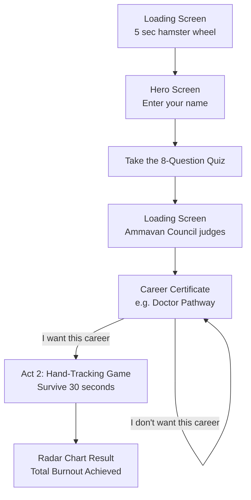

# Oru Average Malayali — Familial Career Allocation Protocol

A two-act satirical web + hand-tracked experience. Act 1 is the AI career agent that always assigns Engineer / Doctor / Nurse Abroad; Act 2 is a real-time OpenCV hand-tracking game about surviving Indian academic pressure.

## Screenshots

*Loading screen with the hamster wheel during the "Malayali Rat Race" boot sequence.*

*Hero screen — the claymation diorama, aspirant name input, and "Find Out My Future" start button.*

*Quiz screen with the dark-emerald kinetic grid background and the 8-step questionnaire.*

*Certificate rendered by the Ammavan Council — assigned career pathway, signatures, and pearl-styled action buttons.*

*Transition screen bridging to Act 2, the real-time OpenCV hand-tracking round.*

## Diagrams

*Workflow: a loading intro leads to the hero screen, then an 8-question quiz, then the Ammavan Council "judges" the answers and issues a career certificate. Accepting the verdict starts the Act 2 hand-tracking game; rejecting it is instantly overruled and sends you right back to your certificate.*