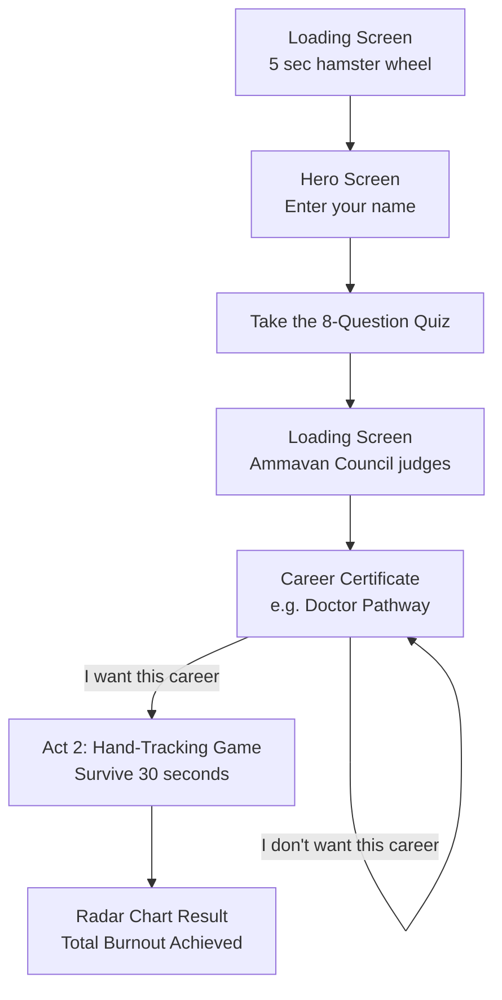

# An average Malayali Kido 🎯


## Basic Details
### Team Name: Silent Shields


### Team Members
- Team Lead: Amana Fathima K F - Adi Shankara Institute Of Engineering And Technology
- Member 2: Diya Joshy - Adi Shankara Institute Of Engineering And Technology

### Project Description
What happens when a kid comes to 12th and wanna decide his/her career? She has a lot of options. Commercial Aviation, Product Design, Corporate Law
Ahhh, just kidding: a DOCTOR or an Engineer.
That's the Indian taboo. Build around suggesting the perfect career to an Indian student: a DOCTOR or an ENGINEER, and make them suffer assignments, projects, and extracurriculars.

### The Problem (that doesn't exist)
Indian students have a lot of career options, and they don't know which to pick. Sarcastically, everything seems to narrow down to a doctor or engineer, the best careers in the world! Besides, these careers have no workloads at all; students are always free vibing with friends and enjoying life to the fullest!

### The Solution (that nobody asked for)
We provide a real career-deciding agent and ask introspective questions to understand what they like and dislike so they can choose the right career for them. But... the career is always doctor or engineer! The best careers in the world!
Then comes their course; we let them manage between projects, hackathons, extracurriculars, and academics. At the end, what happens? They lose their mental stability and have zero sleep.Yay!

## Technical Details
### Technologies/Components Used
For Software:
- **Languages used:** Python, JavaScript, HTML5, CSS3
- **Frameworks used:** Pygame
- **Libraries used:** OpenCV, MediaPipe, NumPy, Google Gemini API, Web Audio API
- **Tools used:** VS Code, Git, Google AI Studio, PowerShell, Python HTTP Server


### Implementation
For Software:
# Installation
```bash
pip install opencv-python mediapipe pygame numpy
```
# Run
```bash
python server.py 8080
```
Open `http://localhost:8080` in your browser.


### Project Documentation
For Software:

# Screenshots (Add at least 3)


*Loading screen with the hamster wheel during the "Malayali Rat Race" boot sequence.*


*Hero screen — the claymation diorama, aspirant name input, and "Find Out My Future" start button.*


*Quiz screen with the dark-emerald kinetic grid background and the 8-step questionnaire.*


*Certificate rendered by the Ammavan Council — assigned career pathway, signatures, and pearl-styled action buttons.*


*Transition screen bridging to Act 2, the real-time OpenCV hand-tracking round.*

# Diagrams
## Diagrams



*Workflow: a loading intro leads to the hero screen, then an 8-question quiz, then the Ammavan Council "judges" the answers and issues a career certificate. Accepting the verdict starts the Act 2 hand-tracking game; rejecting it is instantly overruled and sends you right back to your certificate.*


### Project Demo
# Video
https://youtu.be/dY7Fbu2Pu4c
The career agent giving the best life to a kid!

## Team Contributions
- Amana Fathima K F : UI desinger, Idea storming
- Diya Joshy: backend devloper, Idea storming 

---
Made with ❤️ at TinkerHub Useless Projects 


